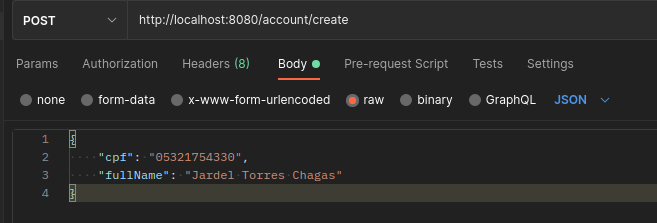
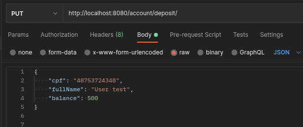
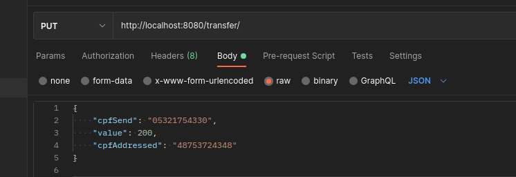

# Tecnologia utilizadas
## back end
- Kotlin
- Spring Boot 
- MongoDB

## Testes 
- JUnit

## Dependecias do projeto
- Spring Web
- Spring Data MongoDB
- Embedded MongoDB Database

# Como executar o projeto
ainda para fazer
# Corpo das requisições 
## Criando a conta

## Criando depositando 

## Fazendo Transferencia

